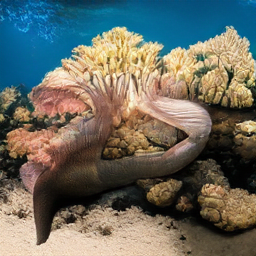

# A Lightweight Text-Aligned Autoregressive MLLM for Visual Understanding and Generation

This project builds a unified autoregressive MLLM for visual understanding and generation based on fully discrete, text-aligned visual tokens. The multimodal framework follows the [Tar](https://github.com/csuhan/Tar) project. The model is lightweight, with only about `1.6B` parameters in total (LLM + Text-Aligned Tokenizer + De-Tokenizer), making it suitable for edge-side applications.

## Project Overview

- LLM: [Qwen3-0.6B](https://huggingface.co/Qwen/Qwen3-0.6B)

- Text-Aligned Tokenizer: [SigLIP2](https://huggingface.co/google/siglip2-so400m-patch14-384) as the visual encoder

- De-Tokenizer: [RAR-L](https://yucornetto.github.io/projects/rar.html) model architecture and [LlamaGen](https://huggingface.co/peizesun/llamagen_t2i/resolve/main/vq_ds16_t2i.pt) VQ-VAE; output resolution `256 x 256 px`

- Model scale: about `1.6B` parameters in total

- Training hardware: `2 x RTX PRO 6000 GPU`

This project represents images as text-aligned discrete visual tokens and uses the same visual token interface for both image understanding and image generation. The resulting unified autoregressive MLLM has only about `1.6B` parameters in total, making it substantially smaller than most comparable multimodal models.

On the MME benchmark, the model achieves competitive visual understanding performance, reaching a level comparable to or better than several LLaMA-7B-based MLLMs. For text-to-image generation, the current model can generate `256 x 256` images in specific scenarios. However, its generation quality and diversity are still limited by the scale of the training data and available compute resources, leaving significant room for improvement.

## Example

### Image-to-Text

Prompt: Describe this image.


Output:

```
The image depicts a serene landscape featuring a small house situated on a lake. The house is surrounded by a beautiful forest, with trees surrounding the lake and the surrounding area. The lake is surrounded by a body of water, and the house is located near the water's edge. The scene is peaceful and picturesque, with the house and the surrounding forest creating a harmonious blend of natural beauty and human-made structures.
```

### Text-to-Image

Prompt: Beneath the expansive night sky, sprinkled with myriad twinkling stars, a flag adorning the pinnacle of a towering lighthouse drifts gently in the evening breeze, its hues subdued by the soft silver glow of the moon. The sturdy structure of the lighthouse, painted in alternating bands of white and red, stands as a stalwart sentinel on the rugged shoreline.

Output: (`256 x 256 px`)


Other generated images:

| A photo of a boat sailing on the sea.                        | A cake on a table                                      | Depict an underwater scene.            |
| ------------------------------------------------------------ | ------------------------------------------------------ | -------------------------------------- |
|  | .png) |  |

## Installation

```bash
git clone https://github.com/qhdxwyx/A-Lightweight-Text-Aligned-Autoregressive-MLLM-for-Visual-Understanding-and-Generation
cd UMLLM

conda create -n UMLLM python=3.10 -y
conda activate UMLLM

pip install -r requirements.txt
```

For CUDA 12.8 environments:

```bash
bash scripts/install_cu128.sh
```

## Inference

Assume this repository has already been cloned locally and the checkpoints are placed under the following paths:

```text
asset/vq_ds16_t2i.pt
output_dir/qwen3_0.6B_train/
output_dir/ta_tok.pth
output_dir/rar_l_dtok_256/latest.pth
```

Set up the runtime environment:

```bash
cd UMLLM
conda activate UMLLM

export PYTHONPATH=$(pwd):${PYTHONPATH}
export CUDA_VISIBLE_DEVICES=0
```

### Image-to-Text

```bash
python - <<'PY'
import torch
from PIL import Image

import llava.model
from llava.constants import IMAGE_TOKEN_INDEX
from llava.conversation import conv_templates
from llava.mm_utils import process_images, tokenizer_image_token
from llava.model.builder import load_pretrained_model

model_path = "output_dir/qwen3_0.6B_train"
image_path = "asset/demo.jpg"
prompt = "Describe this picture."
device = "cuda:0"

tokenizer, model, image_processor, _ = load_pretrained_model(
    model_path,
    None,
    "llava_qwen",
    device_map=device,
    multimodal=True,
    attn_implementation="sdpa",
)

model.eval()

image = Image.open(image_path).convert("RGB")
image_tensor = process_images([image], image_processor, model.config)
image_tensor = image_tensor.to(device=device, dtype=torch.bfloat16)

conv = conv_templates["qwen_3"].copy()
conv.append_message(conv.roles[0], "<image>\n" + prompt)
conv.append_message(conv.roles[1], None)
input_text = conv.get_prompt()

input_ids = tokenizer_image_token(
    input_text,
    tokenizer,
    IMAGE_TOKEN_INDEX,
    return_tensors="pt",
).unsqueeze(0).to(device)

attention_mask = torch.ones_like(input_ids)

with torch.inference_mode():
    output_ids = model.generate(
        input_ids,
        attention_mask=attention_mask,
        images=image_tensor,
        do_sample=False,
        max_new_tokens=256,
        pad_token_id=tokenizer.eos_token_id,
    )

raw = tokenizer.batch_decode(output_ids, skip_special_tokens=False)[0]
answer = raw.split("<|im_start|>assistant\n")[-1]
answer = answer.split("<|im_end|>")[0].strip()
print(answer)
PY
```

### Text-to-Image

```bash
mkdir -p outputs

python t2i_inference_rar.py \
  --model-path output_dir/qwen3_0.6B_train \
  --rar-path output_dir/rar_l_dtok_256/latest.pth \
  --encoder-path output_dir/ta_tok.pth \
  --decoder-path asset/vq_ds16_t2i.pt \
  --prompt "A photo of a boat sailing on the sea." \
  --output outputs/boat.png \
  --device cuda:0 \
  --dtype bf16 \
  --scale 0 \
  --seq-len 729 \
  --temperature 0.8 \
  --top-p 0.9 \
  --top-k 800 \
  --cfg-scale 3.0
```

The output image will be saved to `outputs/boat.png`.

## Training

### Qwen3-0.6B Multimodal Training

Entry point:

```bash
export AUTO_DOWNLOAD=1
export NUM_GPUS=1
export PER_DEVICE_TRAIN_BATCH_SIZE=8
export GRADIENT_ACCUMULATION_STEPS=4
export GRADIENT_CHECKPOINTING=True
export TORCH_COMPILE=False

bash scripts/Qwen3_0.6B_pretrain.sh
```

Mixed training datasets:

| Dataset | Usage |
| --- | --- |
| `LLaVA-ReCap-118K` | image-text alignment |
| `LLaVA-ReCap-558K` | image-text alignment |
| `LLaVA-SFT-665K` | visual instruction data |
| `ImageNet1K-T2I-QwenVL-FLUX` | text-to-image token modeling |
| `Magpie-Qwen2.5-Pro-1M-v0.1` | language instruction data |

### Text-Aligned Tokenizer Training

Entry point:

```bash
export PYTHONPATH=$(pwd):${PYTHONPATH}
export CUDA_VISIBLE_DEVICES=0

export IMAGE_ROOT=/path/to/train_images
export TA_TOK_OUTPUT_DIR=output_dir/ta_tok_train

export NUM_PROCESSES=1
export TA_TOK_BATCH_SIZE=2
export TA_TOK_GRAD_ACCUM_STEPS=8
export TA_TOK_NUM_WORKERS=8
export TA_TOK_PREFETCH_FACTOR=4
export TA_TOK_MAX_STEPS=100000

bash scripts/train_ta_tok.sh
```

Main config:

```text
scripts/ta_tok_384.yaml
```

Encoder: [siglip2-so400m-patch14-384](https://huggingface.co/google/siglip2-so400m-patch14-384)

Training dataset: image-only data [laion_aesthetics](https://laion.ai/blog/laion-aesthetics/)

You can also directly use the pretrained checkpoint from the Tar project: [ta_tok.pth](https://huggingface.co/csuhan/TA-Tok/resolve/main/ta_tok.pth).

### De-Tokenizer Training

Entry point:

```bash
export PYTHONPATH=$(pwd):${PYTHONPATH}
export CUDA_VISIBLE_DEVICES=0

export IMAGE_ROOT=/path/to/train_images
export TA_TOK_PATH=output_dir/ta_tok.pth
export VQVAE_PATH=asset/vq_ds16_t2i.pt
export OUTPUT_DIR=output_dir/rar_l_dtok_256

export NUM_PROCESSES=1
export RAR_BATCH_SIZE=4
export RAR_GRAD_ACCUM_STEPS=2
export RAR_NUM_WORKERS=8
export RAR_PREFETCH_FACTOR=4
export RAR_MAX_STEPS=250000

bash scripts/train_rar_l_dtok_256.sh
```

Main config:

```text
scripts/rar_l_dtok_256.yaml
```

Model architecture: [RAR-L](https://yucornetto.github.io/projects/rar.html) 

Output resolution: `256 x 256 px`

Training dataset: [laion_aesthetics_v2_6.25plus](https://huggingface.co/datasets/xingjianleng/laion_aesthetics_v2_6.25plus) about 3M image-text pairs

## Evaluation

### 1. Image Understanding

MME example with `lmms_eval`:

```bash
torchrun \
  --nproc_per_node=1 \
  --nnodes=1 \
  --node_rank=0 \
  --master_addr=127.0.0.1 \
  --master_port=29507 \
  -m lmms_eval \
  --model llava_onevision \
  --model_args pretrained=output_dir/qwen3_0.6B_train,conv_template=qwen_3,model_name=llava_qwen \
  --tasks mme \
  --batch_size 1 \
  --log_samples \
  --log_samples_suffix qwen3_0.6B_train \
  --output_path ./logs/qwen3_0.6B_train/
```

Other possible tasks:

```text
mme,gqa,pope,mmbench_en_dev,seedbench,mmmu
```

Result table:

| Benchmark | Metric     |    Score | Comparable Models                                            |
| --------- | ---------- | -------: | ------------------------------------------------------------ |
| MME       | perception | 939.2999 | [mPLUG-Owl](https://arxiv.org/pdf/2304.14178.pdf) (LLaMA-7B), [LaVIN](https://arxiv.org/pdf/2305.15023.pdf) (LAVIN-13B) |
| MME       | cognition  | 230.7143 | [VPGTrans](https://arxiv.org/pdf/2305.01278.pdf) (Vicuna-7B), [LaVIN](https://arxiv.org/pdf/2305.15023.pdf) (LAVIN-13B) |

### 2. De-Tokenizer reconstruction

This is a local diagnostic for the De-Tokenizer. It measures the De-Tokenizer prediction loss and saves original/reconstruction pairs.

```bash
python eval/eval_rar_dtok.py \
  --rar-path output_dir/rar_l_dtok_256/latest.pth \
  --ta-tok-path output_dir/ta_tok.pth \
  --vqvae-path asset/vq_ds16_t2i.pt \
  --image-root /path/to/eval_images \
  --output-dir eval_outputs/rar_dtok_1k \
  --device cuda:0 \
  --dtype bf16 \
  --batch-size 2 \
  --num-workers 8 \
  --limit 1024 \
  --pool-scale 1 \
  --save-samples -1
```

Output files:

```text
metrics.json
samples.jsonl
sample_0000_orig_recon.png
sample_0001_orig_recon.png
...
```

Results:

|  |  |
| ------------------------------------------------------------ | ------------------------------------------------------------ |
|  |  |

Due to the small training set, limited model parameters, and constrained training resources, there remains significant room for improvement.

## Citation

Please cite these works if this repository is useful for your work:

```bibtex
@article{han2025tar,
  title={Vision as a Dialect: Unifying Visual Understanding and Generation via Text-Aligned Representations},
  author={Han, Jiaming and Chen, Hao and Zhao, Yang and Wang, Hanyu and Zhao, Qi and Yang, Ziyan and He, Hao and Yue, Xiangyu and Jiang, Lu},
  journal={arXiv preprint arXiv:2506.18898},
  year={2025}
}
```

```bibtex
@article{he2025flowtok,
  author    = {Ju He and Qihang Yu and Qihao Liu and Liang-Chieh Chen},
  title     = {FlowTok: Flowing Seamlessly Across Text and Image Tokens},
  journal   = {arXiv preprint arXiv:2503.10772},
  year      = {2025}
}
```

```bibtex
@article{kim2025democratizing,
  author    = {Dongwon Kim and Ju He and Qihang Yu and Chenglin Yang and Xiaohui Shen and Suha Kwak and Liang-Chieh Chen},
  title     = {Democratizing Text-to-Image Masked Generative Models with Compact Text-Aware One-Dimensional Tokens},
  journal   = {arXiv preprint arXiv:2501.07730},
  year      = {2025}
}
```

```bibtex
@article{yu2024randomized,
  author    = {Qihang Yu and Ju He and Xueqing Deng and Xiaohui Shen and Liang-Chieh Chen},
  title     = {Randomized Autoregressive Visual Generation},
  journal   = {arXiv preprint arXiv:2411.00776},
  year      = {2024}
}
```

```bibtex
@article{yu2024an,
  author    = {Qihang Yu and Mark Weber and Xueqing Deng and Xiaohui Shen and Daniel Cremers and Liang-Chieh Chen},
  title     = {An Image is Worth 32 Tokens for Reconstruction and Generation},
  journal   = {NeurIPS},
  year      = {2024}
}
```

```bibtex
@article{sun2024autoregressive,
  title={Autoregressive Model Beats Diffusion: Llama for Scalable Image Generation},
  author={Sun, Peize and Jiang, Yi and Chen, Shoufa and Zhang, Shilong and Peng, Bingyue and Luo, Ping and Yuan, Zehuan},
  journal={arXiv preprint arXiv:2406.06525},
  year={2024}
}
```
